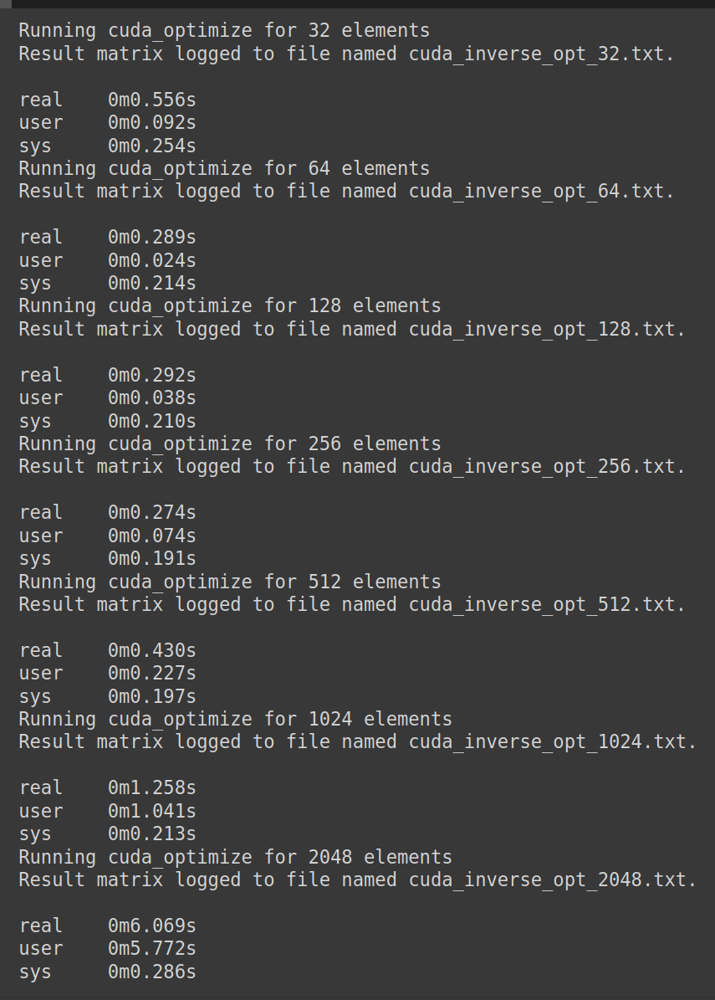

# CUDA

Program ini menginversi matriks menggunakan algoritma eliminasi Gauss-Jordan, yang diparalelkan menggunakan CUDA (paralelisme berbasis GPU). Implementasi ini memanfaatkan kernel CUDA untuk menangani operasi normalisasi baris dan eliminasi dalam thread-thread pada GPU.

## Cara Kerja Paralelisasi Program:
Proses paralelisasi menggunakan CUDA adalah sebagai berikut:

1. Program membaca dan menginisialisasi matriks pada sisi kanan dengan identitas.
2. Setiap iterasi melakukan normalisasi baris dan eliminasi baris pivot menggunakan kernel CUDA. Catatan: Stride pada kode merepresentasikan kolom, N adalah jumlah baris. Pada setiap blok yang dipakai, ada sejumlah 16x16 atau 256 thread yang bekerja. Ukuran blok tersebut dipilih supaya akses memori coalesced dengan efektif.
- Normalisasi: Setiap kolom dalam baris pivot dibagi dengan nilai pivot. Operasi ini diparalelkan menggunakan thread pada GPU.
- Eliminasi: Setiap baris kecuali baris pivot diperbarui untuk menghilangkan elemen kolom. Operasi ini juga diparalelkan di mana setiap thread akan memperbarui baris yang berbeda secara independen.
3. Titik sinkronisasi digunakan setelah setiap eksekusi kernel (normalisasi terlebih dahulu baru eliminasi) untuk memastikan supaya matriks diperbarui dengan benar sebelum operasi selanjutnya.
4. Setelah semua operasi selesai maka akan disimpan hasil matriksnya.

## Cara Program Anda Membagikan Data Antar-Proses atau Antar-Thread dan Alasan Pemilihan Skema Pembagian Data:

Skema pembagian data yang dipilih adalah `Data Parallelism`. Skema ini didasarkan pada karakteristik operasi yang dilakukan pada matriks. Parallelisme ini dilakukan pada saat normalisasi matriks (setiap integer dalam array dibagi oleh nilai pivot yang sama). Selain itu juga dilakukan saat eliminasi kolom dengan row pivot (setiap row dieliminasi dengan pivot yang sama).

1. Pada proses normalisasi, data row dibagi pada thread agar setiap kolom dapat dinormalisasi secara parallel.
2. Pada proses eliminasi, setiap row dibagi pada thread agar dapat dieliminasi dengan row pivot secara parallel.

Ada dependensi antara task normalisasi dan eliminasi oleh karena itu, operasi ini harus menunggu satu sama lain dan tidak bisa sepenuhnya parallel (terdapat task dependency antara normalisasi dan eliminasi).

## Limitasi program
1. Tidak kasus matriks yang tidak memilik invers.
2. Testing hanya dilakukan dengan test cases, tidak diluar test case tersebut.

## Hasil Eksekusi

