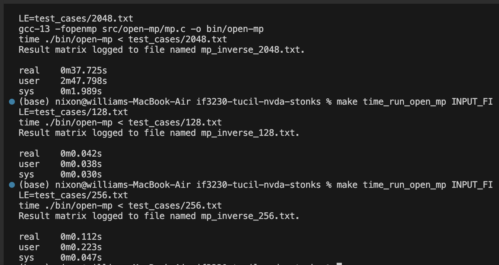

# OPEN_MP

Program ini mencari invers matriks menggunakan algoritma Gauss-Jordan dengan paralelisasi menggunakan OpenMP (thread-based parallelism), yang membagi proses eliminasi ke dalam beberapa thread.

## Cara Kerja Paralelisasi Program:
Proses paralelisasi menggunakan OpenMP adalah sebagai berikut:

1. Program membaca dan menginisialisasi matriks pada sisi kanan dengan identitas.
2. Setiap iterasi akan dilakukan normalisasi dan eliminasi baris pivot menggunakan paralelisasi OpenMP.
3. Pada awal setiap iterasi, program memilih indeks pivot dengan menghitung offset. Jika nilai pivotnya mendekati nol, proses normalisasi dilewati karena baris tersebut sudah dinormalisasi sebelumnya. Namun, jika nilai pivot tidak mendekati nol, maka setiap elemen kolom pada baris pivot dibagi dengan nilai pivotnya. Paralelisasi dilakukan pada tahap ini menggunakan `#pragma omp parallel for` untuk membagi setiap kolom secara parallel.
4. Setelah normalisasi, eliminasi dilakukan untuk setiap kolom pada matriks kecuali kolom pivot. Proses eliminasi juga dapat diparalelkan menggunakan `#pragma omp parallel for`, agar setiap row dapat dikerjakan mandiri.
5. Setelah semua operasi selesai maka akan disimpan hasil matriksnya.

## Cara Program Anda Membagikan Data Antar-Proses atau Antar-Thread dan Alasan Pemilihan Skema Pembagian Data:

Skema pembagian data yang dipilih adalah `Data Parallelism`. Skema ini didasarkan pada karakteristik operasi yang dilakukan pada matriks. Parallelisme ini dilakukan pada saat normalisasi matriks (setiap integer dalam array dibagi oleh nilai pivot yang sama). Selain itu juga dilakukan saat eliminasi kolom dengan row pivot (setiap row dieliminasi dengan pivot yang sama).

1. Pada proses normalisasi, data row dibagi pada thread agar setiap kolom dapat dinormalisasi secara parallel.
2. Pada proses eliminasi, setiap row dibagi pada thread agar dapat dieliminasi dengan row pivot secara parallel.

Dapat juga diperhatikan bahwa proses normalisasi dan eliminasi masih harus menunggu satu sama lain, tidak bisa sepenuhnya parallel (terdapat task dependency antara normalisasi dan eliminasi). 

## Limitasi program
1. Tidak kasus matriks yang tidak memilik invers.
2. Testing hanya dilakukan dengan test cases, tidak diluar test case tersebut.

## Hasil Eksekusi
